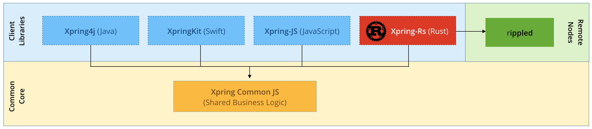

# Contributing

Thanks for considering a contribution to [xpring-rs](https://github.com/elmurci/xpring-rs)!

We're thrilled you're interested and your help is greatly appreciated. Contributing is a great way to learn about the [XRP Ledger](https://xrpl.org) and [Interledger Protocol (ILP)](https://interledger.org/). We are happy to review your pull requests. To make the process as smooth as possible, please read this document and follow the stated guidelines.

## About This Library

Xpring4J is a Java library that is shipped as a consumable artifact in Maven Central..

This library relies depends on both:

Xpring Common JS: Common code shared across Xpring SDK in JavaScript.
Xpring Common Protocol Buffers: Common protocol buffers shared across Xpring SDK.

## Building The Library

TBD